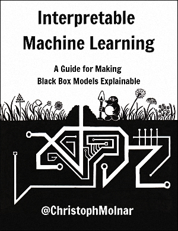

# 可解释的机器学习

> 原书：[christophm/interpretable-ml-book](https://christophm.github.io/interpretable-ml-book/index.html)
> 
> 协议：[CC BY-NC-SA 4.0](http://creativecommons.org/licenses/by-nc-sa/4.0/)
>
> 我相信大家都知道程序员讨厌的四件事，那就是：写注释、写文档、别人不写注释、别人不写文档。

- [ApacheCN 机器学习交流群 629470233](http://shang.qq.com/wpa/qunwpa?idkey=30e5f1123a79867570f665aa3a483ca404b1c3f77737bc01ec520ed5f078ddef)
- [ApacheCN 学习资源](http://www.apachecn.org/)

## 目录

+   [前言](docs/0.md)
+   [第一章 引言](docs/1.md)
+   [第二章 解释性](docs/2.md)
+   [第三章 数据集](docs/3.md)
+   [第四章 解释模型](docs/4.md)
+   [第五章 模型不可知论方法](docs/5.md)
+   [第六章 基于实例的解释](docs/6.md)
+   [第七章 神经网络解释](docs/7.md)
+   [第八章 水晶球](docs/8.md)
+   [第九章 贡献](docs/9.md)
+   [第十章 引用本书](docs/10.md)

## 致谢

感谢原作者与百度翻译API，以下为作者联系方式

Mail: [christoph.molnar.ai@gmail.com](mailto:christoph.molnar.ai@gmail.com)

Website: <https://christophm.github.io/>

Follow me on Twitter! [@ChristophMolnar](https://twitter.com/ChristophMolnar)

Cover by [@YvonneDoinel](https://twitter.com/YvonneDoinel)

可以在  [leanpub.com](https://leanpub.com/interpretable-machine-learning) 购买PDF和电子书版（epub, mobi）

可以在 [lulu.com](http://www.lulu.com/shop/christoph-molnar/interpretable-machine-learning/paperback/product-24036234.html) 上面购买纸质版

## 负责人

- [wnma](interpretable-ml-book): 1003324213

## 贡献指南

项目当前处于翻译阶段，请查看[贡献指南](CONTRIBUTING.md)，并在[整体进度](https://github.com/apachecn/interpretable-ml-book-zh/issues/1)中领取任务。

> 请您勇敢地去翻译和改进翻译。虽然我们追求卓越，但我们并不要求您做到十全十美，因此请不要担心因为翻译上犯错——在大部分情况下，我们的服务器已经记录所有的翻译，因此您不必担心会因为您的失误遭到无法挽回的破坏。（改编自维基百科）

## 赞助我们

